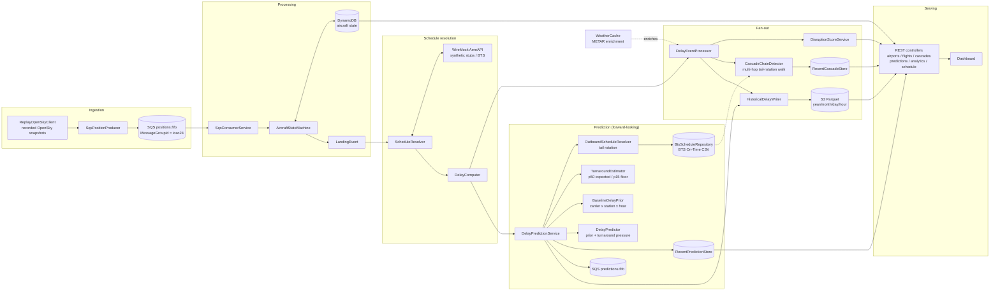

# SkyTrack

**Real-time flight delay detection, departure prediction, and airport-disruption scoring.**

SkyTrack ingests live aircraft positions, detects landings with a per-aircraft state machine,
resolves each landing against a flight schedule to compute its delay, and scores every US
airport for disruption in real time. On each landing it also looks *forward*: it resolves the
aircraft's next leg from its tail rotation and predicts that departure's delay, then walks the
rotation multi-hop to project how the delay cascades downstream. Everything is measured against
real BTS on-time data in an offline backtest with a train/eval split. It runs entirely on free
data and Free-Tier/credit-covered AWS — no paid flight API is ever used.

---

## Architecture



Six layers (full write-up in [docs/architecture.md](docs/architecture.md)):

1. **Ingestion** — `ReplayOpenSkyClient` replays recorded OpenSky ADS-B snapshots;
   `SqsPositionProducer` publishes one message per position to `skytrack-positions.fifo` keyed
   by `icao24` for per-aircraft ordering.
2. **Processing** — `SqsConsumerService` feeds `AircraftStateMachine`
   (`UNKNOWN → EN_ROUTE → APPROACHING → ON_GROUND → DEPARTED`), persisting to DynamoDB and
   emitting a `LandingEvent` on touchdown.
3. **Schedule resolution** — `ScheduleResolver` resolves the scheduled arrival via
   `AeroApiClient` (WireMock synthetic stubs locally); `DelayComputer` computes
   `delay = actualArrival − scheduledArrival`.
4. **Processing fan-out** — `DelayEventProcessor` enriches each `DelayEvent` with weather
   (METAR) and dispatches it to `DisruptionScoreService`, `CascadeChainDetector`, and
   `HistoricalDelayWriter` (→ S3 Parquet).
5. **Prediction** — every resolved arrival triggers `DelayPredictionService`, which resolves the
   aircraft's next leg from its BTS tail rotation and predicts that departure's delay
   (see [Predicting the next departure](#predicting-the-next-departure)).
6. **Serving** — nine REST endpoints feed the dashboard.

## Tech stack

- **Backend:** Java 25, Spring Boot 4.0.2, Lombok, Maven
- **AWS:** SQS FIFO (×3, incl. a dead-letter queue), DynamoDB (single-table), S3 (Parquet
  history) — via AWS SDK v2
- **Local stack:** LocalStack (SQS/DynamoDB/S3), WireMock (schedule API), Docker Compose
- **Data:** OpenSky Network (positions), AviationWeather METAR (weather), **BTS On-Time
  Performance** (612k rows, March 2026 — rotations, schedules and delay ground truth), synthetic
  schedule stubs (anchored to real arrivals) for the live-replay arrival path
- **Dashboard (Phase 2):** vanilla JS + Leaflet, served from Spring `static/`

### What's real vs. synthetic

| Real | Synthetic |
|---|---|
| Aircraft positions (370 recorded OpenSky snapshots) | `scheduled_in` times in the *live replay* path — sampled from a delay distribution **anchored to the real arrival epoch** |
| Landing detection (`AircraftStateMachine`) | Arrival-delay *magnitudes* in that path are plausible but not historically accurate |
| **BTS schedules, tail rotations and `DEP_DELAY` ground truth** (prediction + cascade + all backtests) | |
| Schedule-resolution path (`AeroApiClient → ScheduleResolver → DelayComputer`) | |
| Weather (recorded METAR via `ReplayAviationWeatherClient`) | |
| All downstream scoring, prediction and cascade logic | |

The synthetic tier is now confined to one place: the *arrival* schedule during a live LocalStack
replay. Everything forward-looking — the next-departure prediction, the cascade chain walk, and
every accuracy number below — runs on real BTS data with a train/eval split. Full details:
[synthetic schedule demo results](docs/2026-06-16-synthetic-schedule-demo-results.md).
**No paid flight API is ever used.**

## Predicting the next departure

When an aircraft lands, its next leg is already at risk. `OutboundScheduleResolver` finds that
leg by tail rotation in the BTS schedule (bounded by a 6-hour lookahead, so overnight parks are
not attributed to the arrival), and `DelayPredictor` scores it as **two additive terms**:

```
predicted = baselinePrior(carrier, station, hour) + max(0, (arrival + turnaround) − schedDep)
```

- **Turnaround pressure** — the physical feasibility term. It fires only when the aircraft
  cannot be ready in time, so any rotation with adequate slack scores zero from this term alone.
- **Baseline prior** — habitual delay for that carrier/station/hour, fitted on the training
  window. Commonly *negative*: most flights push back early. Predictions are therefore signed,
  matching BTS `DEP_DELAY`; clamping at zero would bias every slack rotation upward.

The two terms are kept disjoint on purpose — the prior is fitted only on flights with no
late-aircraft delay, which is exactly what the pressure term models. Fitting both on the same
flights would double-count the cascade.

**Turnaround is two quantities, not one.** `TurnaroundEstimator` serves both from the same
pressured population: `expectedTurnaroundSeconds` (p50) for *prediction* — "when will this
aircraft be ready?" wants a central estimate — and `minTurnaroundSeconds` (p15) for *cascade
slack* — "how much buffer before this rotation breaks?" wants a physical floor. Using the p15
floor for prediction assumes every crew hits its best-ever turnaround; doing so measurably
regressed F1 from 0.611 to 0.471.

## Cascade chains

`CascadeChainDetector` replaces an earlier flat 0.85 multiplier with a multi-hop walk along the
tail rotation, propagating in delay-space:

```
depDelay[n]     = max(0, carriedArrivalDelay − scheduledSlack[n])
arrivalDelay[n] = depDelay[n] × (1 − enRouteRecovery)
```

A chain terminates when a hop falls below the delay threshold, the rotation ends, a leg is
cancelled, or `cascade-max-hops` (default 8) is reached. Slack absorption is what makes chains
terminate honestly — an earlier version measured slack against *scheduled* ground time, which
subtracts the quantity from itself and was positive only 45.8% of the time; against a pressured
p15 floor it is positive 88.0% of the time.

## Running locally

The whole stack — the app plus its LocalStack and WireMock sidecars — runs under Docker Compose.
The datasets are gitignored, so `data/airports/airports.csv`, `skytrack/data/bts/btsdata.csv` and
`skytrack/data/recorded-opensky/` must exist on the host first; the compose file bind-mounts them
read-only into the container.

```sh
docker compose up --build
curl localhost:8080/airports/disruptions
```

The app starts only after LocalStack reports its init script complete (queues, table and bucket
created). Service endpoints are overridden with environment variables in `docker-compose.yml`,
which Spring's relaxed binding maps onto the `sqs.endpoint`, `skytrack.*.endpoint` and
`aeroapi.base-url` properties otherwise set to `localhost` in `application-local.yml`.

To run the app on the host JVM against the sidecars instead:

```sh
docker compose up -d localstack wiremock
cd skytrack && ./mvnw spring-boot:run -Dspring-boot.run.profiles=local
```

## API reference

Nine endpoints. Disruption/flight/analytics samples are captured from the
[synthetic demo run](docs/2026-06-16-synthetic-schedule-demo-results.md). Prediction and cascade
samples show the true response *shape* with representative values — the aggregate figures are
from the [2026-07-30 backtest](docs/backtest-results-2026-07-30.md), while per-flight fields
(tail numbers, outbound flight numbers) are illustrative.

### `GET /airports/disruptions?limit=10&minScore=0`
Top airports by disruption score (`score`, `activeDelayCount`, `averageDelayMinutes`, `trendDirection`).
```json
[
  {"airportIata": "ORD", "score": 81.67, "activeDelayCount": 10, "totalFlightsInWindow": 15,
   "averageDelayMinutes": 50.0, "trendDirection": 0.67},
  {"airportIata": "SFO", "score": 62.1, "activeDelayCount": 4, "totalFlightsInWindow": 9,
   "averageDelayMinutes": 54.4, "trendDirection": 0.57}
]
```

### `GET /airports/{iata}/status`
Disruption score + current weather (METAR) + active cascade chains for one airport.
```json
{
  "score": {"airportIata": "JFK", "score": 43.19, "activeDelayCount": 3,
            "totalFlightsInWindow": 8, "averageDelayMinutes": 38.4, "trendDirection": 0.375},
  "weather": {"flightCategory": "IFR", "visibilityStatuteMiles": 2.0, "ceilingFeet": 800,
              "rawMetar": "METAR KJFK 051430Z 18012G18KT 2SM RA OVC008"},
  "cascades": [ /* active CascadeChain objects, see below */ ]
}
```

### `GET /flights/{callsign}`
Latest tracked state for an aircraft by callsign (404 if unknown).
```json
{"icao24": "a9b62c", "callsign": "AAL103", "state": "ON_GROUND",
 "nearestAirportIcao": "KJFK", "latitude": 40.64, "longitude": -73.78, "lastSeen": 1773078820}
```

### `GET /cascades/{iata}`
Recent cascade *chains* for an airport — a delayed inbound aircraft walked multi-hop along its
tail rotation. Each hop carries the model output and, where BTS knows it, the actual.
```json
[
  {"sourceCallsign": "AAL1101", "originAirportIata": "ORD", "sourceArrivalDelaySeconds": 13680,
   "flightsAffected": 2, "totalPredictedDelaySeconds": 15240,
   "hops": [
     {"carrierIata": "AA", "flightNumber": "1101", "tailNumber": "N826AW",
      "originIata": "ORD", "destIata": "PHX", "scheduledDepEpoch": 1773083700,
      "predictedDepDelaySeconds": 11580, "actualDepDelaySeconds": 11940,
      "lateAircraftDelaySeconds": 11700}
   ],
   "createdAt": "2026-06-20T14:32:10Z"}
]
```

### `GET /cascades/{iata}/accuracy`
Hop-level scoring of those chains against BTS actuals.
```json
{"airportIata": "ORD", "totalChains": 187, "totalHops": 328, "backtestableHops": 328,
 "hopLevelMaeSeconds": 770.8, "avgChainLength": 1.75,
 "truePositives": 105, "falsePositives": 3, "precision": 0.972}
```

### `GET /predictions/{iata}`
Predicted departure delays for aircraft that just landed at this airport. `actualDelaySeconds`
is populated only when BTS ground truth is available (null in a live run).
```json
[
  {"inboundCallsign": "AAL820", "tailNumber": "N826AW", "departureAirportIata": "ORD",
   "outboundCarrier": "AA", "outboundFlightNumber": "1364",
   "observedInboundArrivalEpoch": 1773081960, "outboundScheduledDepEpoch": 1773093420,
   "minTurnaroundSeconds": 2700, "predictedDelaySeconds": 1302,
   "predictedClassification": "MINOR", "actualDelaySeconds": 7080,
   "confidence": "MEDIUM", "createdAt": "2026-07-30T20:38:41Z"}
]
```

### `GET /predictions/{iata}/accuracy`
MAE plus a predicted-vs-actual confusion matrix over `DelayClassification`. (Counts below are
the corpus-wide backtest totals, abridged to the `ON_TIME` predicted row.)
```json
{"airportIata": "ORD", "totalPredictions": 1951, "backtestableCount": 1951,
 "meanAbsoluteErrorSeconds": 483.1,
 "confusionMatrix": {"ON_TIME": {"ON_TIME": 997, "MINOR": 244, "MODERATE": 65, "MAJOR": 21}}}
```

### `GET /analytics/delays?airport={iata}&date={yyyy-MM-dd}`
Historical delay events read back from S3 Parquet (date = the Parquet partition, UTC).
```json
[
  {"callsign": "UAL973", "arrivalAirportIata": "ORD", "classification": "SEVERE",
   "delaySeconds": 11160, "resolutionMethod": "AEROAPI", "flightCategory": "VFR"}
]
```

### `GET /schedule/coverage`
How many tracked arrivals were resolved against a schedule.
```json
{"total": 383, "verified": 208, "estimated": 0, "unresolved": 175, "verifiedRate": 0.5430809399477807}
```

## Accuracy

`AccuracyBacktestIT` replays the recorded OpenSky day against real BTS data and scores the model
against three baselines. Priors and turnaround percentiles are fitted on **2026-03-01..03-08**
and scored on the **03-09** replay — fitting and scoring the same day leaks the answer.

**Departure-delay prediction** (n=1951, [full report](docs/backtest-results-2026-07-30.md)):

| Arm | MAE (s) | RMSE (s) | p50 | p90 | Precision | Recall | F1 |
|---|---|---|---|---|---|---|---|
| **model** | **483.1** | **1294.0** | **240** | **936** | **0.887** | **0.534** | **0.667** |
| flat (0.85 propagation) | 898.8 | 1598.2 | 612 | 1800 | 0.747 | 0.461 | 0.570 |
| prior only | 758.9 | 1658.1 | 300 | 1920 | 0.600 | 0.008 | 0.015 |
| zero | 791.5 | 1631.7 | 360 | 1800 | 0.000 | 0.000 | 0.000 |

The model arm wins on **every** metric — 39.0% better MAE than always-predicting-zero. The
ablation is the interesting part: the prior alone is worth 32.6s of MAE (4.1%), while adding
turnaround pressure is worth 275.8s (36.3%). **The physics term does almost all the work**; a
carrier/station lookup table would not have sufficed. MAE 483.1 against a p50 of 240s says the
error is tail-driven — the typical prediction is about twice as good as the mean suggests.

**Cascade chains** (187 chains, 328 hops):

| Metric | Value |
|---|---|
| Hop MAE vs late-aircraft delay | **770.8s** (bias **−5.1s**) |
| Hop MAE vs *total* departure delay | 1346.1s (bias −547.2s) |
| Precision / Recall / F1 (≥15 min) | **0.972 / 0.455 / 0.620** |
| Average chain length | 1.75 hops |

Scoring target matters more than tuning here. Judged against the component it actually models —
BTS `LATE_AIRCRAFT_DELAY` — the detector is essentially unbiased. The −547s bias against *total*
departure delay was never model error; it is the carrier, NAS and weather delay a turnaround
model has no mechanism to predict. Roughly 80% of the F1 gain from 0.139 → 0.620 came from
fixing two measurement bugs (a recall denominator counting structurally unreachable legs, and a
cascade gate that refused to *start* rotation walks) rather than from tuning the model.

Full analysis, including why the p15 turnaround floor had to be split from the p50 estimate:
[docs/accuracy-stages-0-5-analysis.md](docs/accuracy-stages-0-5-analysis.md).

## Pipeline results

From the [synthetic schedule demo run](docs/2026-06-16-synthetic-schedule-demo-results.md)
(replay OpenSky + WireMock synthetic stubs + LocalStack):

| Metric | Value |
|---|---|
| Schedule coverage (resolved) | **208 / 383 (54.3%)** via AEROAPI |
| Prediction coverage (backtest) | **1951 / 4109 landings (47.5%)** reach ground truth |
| Top disruption score | **ORD 81.7** (10 active delays, avg 50 min) |
| Disruption leaderboard | 10+ airports non-empty (ORD, CAK, PDX, LGA, SFO, …) |
| Delay classifications | ON_TIME / MINOR / MODERATE / MAJOR / SEVERE |
| Test suite | **416 tests, 0 failures** (2 gated tests skipped) |

The prediction funnel loses most of its volume at callsign parsing (4109 landings → 2275 parsed
→ 2061 inbound legs matched → 1951 scored). Coverage is a `CallsignParser` problem, not a model
problem.

## License

[MIT](LICENSE)
