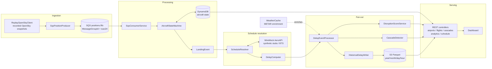

# SkyTrack

**Real-time flight delay detection and airport-disruption scoring.**

SkyTrack ingests live aircraft positions, detects landings with a per-aircraft state machine,
resolves each landing against a flight schedule to compute its delay, and scores every US
airport for disruption in real time — surfacing delay cascades and historical analytics
through a REST API and dashboard. It runs entirely on free data and Free-Tier/credit-covered
AWS: aircraft positions come from the open OpenSky Network, and schedule ground-truth is
*synthetic but anchored* (no paid flight API), with a path to real BTS on-time data.

<!-- LIVE-URL-PLACEHOLDER: live demo URL added in Phase 3 (AWS deploy). -->
<!-- SCREENSHOT-PLACEHOLDER: dashboard screenshot added in Phase 2. -->

> **Status:** backend proven end-to-end (chunks 1–7), 233 tests green. Dashboard (Phase 2) and
> live AWS deployment (Phase 3) in progress — placeholders above are filled as those land.

---

## Architecture



Five layers (full write-up in [docs/architecture.md](docs/architecture.md)):

1. **Ingestion** — `ReplayOpenSkyClient` replays recorded OpenSky ADS-B snapshots;
   `SqsPositionProducer` publishes one message per position to `skytrack-positions.fifo` keyed
   by `icao24` for per-aircraft ordering.
2. **Processing** — `SqsConsumerService` feeds `AircraftStateMachine`
   (`UNKNOWN → EN_ROUTE → APPROACHING → ON_GROUND → DEPARTED`), persisting to DynamoDB and
   emitting a `LandingEvent` on touchdown.
3. **Schedule resolution** — `ScheduleResolver` resolves the scheduled arrival via
   `AeroApiClient` (WireMock synthetic stubs locally); `DelayComputer` computes
   `delay = actualArrival − scheduledArrival`.
4. **Processing fan-out** — `DelayEventProcessor` enriches each `DelayEvent` with weather
   (METAR) and dispatches it to `DisruptionScoreService`, `CascadeDetector`, and
   `HistoricalDelayWriter` (→ S3 Parquet).
5. **Serving** — six REST endpoints feed the dashboard.

## Tech stack

- **Backend:** Java 25, Spring Boot 4.0.2, Lombok, Maven
- **AWS:** SQS FIFO (×2), DynamoDB (single-table), S3 (Parquet history) — via AWS SDK v2
- **Local stack:** LocalStack (SQS/DynamoDB/S3), WireMock (schedule API), Docker Compose
- **Data:** OpenSky Network (positions), AviationWeather METAR (weather), synthetic schedule
  stubs (anchored to real arrivals); future BTS On-Time Performance
- **Dashboard (Phase 2):** vanilla JS + Leaflet, served from Spring `static/`

### What's real vs. synthetic

| Real | Synthetic |
|---|---|
| Aircraft positions (370 recorded OpenSky snapshots) | `scheduled_in` times per flight — sampled from a delay distribution **anchored to the real arrival epoch** |
| Landing detection (`AircraftStateMachine`) | Delay *magnitudes* are plausible but not historically accurate (until BTS, Phase 4) |
| Schedule-resolution path (`AeroApiClient → ScheduleResolver → DelayComputer`) | |
| Weather (recorded METAR via `ReplayAviationWeatherClient`) | |
| All downstream scoring + cascade logic | |

The pipeline wiring is proven end-to-end; only the schedule *ground-truth* is synthetic. Full
details and the verification run: [synthetic schedule demo results](docs/2026-06-16-synthetic-schedule-demo-results.md).
**No paid flight API is ever used.**

## Run it locally

Verified end-to-end on a clean checkout (see the
[smoke-test](docs/2026-06-06-chunk7-pipeline-smoke-test-results.md) and
[synthetic demo](docs/2026-06-16-synthetic-schedule-demo-results.md) results).

```bash
# 1. Stack: WireMock + LocalStack (auto-creates the two SQS FIFO queues, DynamoDB table, S3 bucket)
docker compose up -d

# 2. Bridge the data roots. The app boots from skytrack/ but airports.csv + weather fixtures
#    live at the repo root. (Phase 3 Task 3.1 loads airports.csv from the classpath, after
#    which the airports symlink is no longer needed.)
ln -sfn ../../data/airports         skytrack/data/airports
ln -sfn ../../data/recorded-weather skytrack/data/recorded-weather

# 3. Run. DevTools restart MUST be off, or the DynamoDB Enhanced mapper throws a
#    ClassCastException across classloaders (see Gotchas). The system property is required —
#    the SPRING_DEVTOOLS_RESTART_ENABLED env var does NOT work (read before env processing).
cd skytrack && SPRING_PROFILES_ACTIVE=local \
  ./mvnw spring-boot:run -Dspring-boot.run.jvmArguments="-Dspring.devtools.restart.enabled=false"

# 4. After a few minutes of replay, query (use the UTC date for the analytics partition):
curl -s localhost:8080/schedule/coverage
curl -s localhost:8080/airports/disruptions?limit=10
curl -s localhost:8080/airports/ORD/status
curl -s "localhost:8080/analytics/delays?airport=ORD&date=$(date -u +%Y-%m-%d)"
```

To regenerate the synthetic schedule stubs (deterministic — same seed → identical stubs):

```bash
cd skytrack && ./mvnw test -Dtest=LandingSeedExtractorIT  -Dskytrack.tooling=true   # one-time, ~2 min
            ./mvnw test -Dtest=WireMockStubGeneratorIT -Dskytrack.tooling=true       # seconds
```

### Gotchas

- **DevTools restart must be disabled** for local runs (`-Dspring.devtools.restart.enabled=false`).
  With it on, `TableSchema.fromBean(AircraftTrack.class)` is built under one classloader while
  runtime instances come from another → `ClassCastException: AircraftTrack cannot be cast to
  AircraftTrack` → 0 landings persisted. The prod jar excludes DevTools, so this is local-only.
- **Data-root split** (the symlinks in step 2): the app's working dir is `skytrack/`, but
  reference data lives at the repo root. Phase 3 moves `airports.csv` onto the classpath.
- **Throughput:** the single-threaded consumer drains ~290 positions/sec against LocalStack —
  fine for a single-host demo; rich disruption data appears after ~40 replay files (~5 min).

## API reference

Six endpoints (samples from the [synthetic demo run](docs/2026-06-16-synthetic-schedule-demo-results.md)):

### `GET /airports/disruptions?limit=10`
Top airports by disruption score (`score`, `activeDelayCount`, `averageDelayMinutes`, `trendDirection`).
```json
[
  {"airportIata": "ORD", "score": 81.67, "activeDelayCount": 10, "totalFlightsInWindow": 15,
   "averageDelayMinutes": 50.0, "trendDirection": 0.67},
  {"airportIata": "SFO", "score": 62.1, "activeDelayCount": 4, "totalFlightsInWindow": 9,
   "averageDelayMinutes": 54.4, "trendDirection": 0.57}
]
```

### `GET /airports/{iata}/status`
Disruption score + current weather (METAR) + active cascade alerts for one airport.
```json
{
  "score": {"airportIata": "JFK", "score": 43.19, "activeDelayCount": 3,
            "totalFlightsInWindow": 8, "averageDelayMinutes": 38.4, "trendDirection": 0.375},
  "weather": {"flightCategory": "IFR", "visibilityStatuteMiles": 2.0, "ceilingFeet": 800,
              "rawMetar": "METAR KJFK 051430Z 18012G18KT 2SM RA OVC008"},
  "cascades": [ /* active CascadeAlert objects */ ]
}
```

### `GET /flights/{callsign}`
Latest tracked state for an aircraft by callsign (404 if unknown).
```json
{"icao24": "a9b62c", "callsign": "AAL103", "state": "ON_GROUND",
 "nearestAirportIcao": "KJFK", "latitude": 40.64, "longitude": -73.78, "lastSeen": 1773078820}
```

### `GET /cascades/{iata}`
Recent delay-cascade predictions for an airport (a delayed inbound aircraft propagating delay
to its next leg).
```json
[
  {"sourceCallsign": "AAL1101", "arrivalAirportIata": "ORD", "currentDelaySeconds": 13680,
   "predictedDownstreamDelaySeconds": 11580, "propagationFactor": 0.85,
   "createdAt": "2026-06-20T14:32:10Z"}
]
```

### `GET /analytics/delays?airport={iata}&date={yyyy-MM-dd}`
Historical delay events read back from S3 Parquet (date = the Parquet partition, UTC).
```json
[
  {"callsign": "UAL973", "arrivalAirportIata": "ORD", "classification": "SEVERE",
   "delaySeconds": 11160, "resolutionMethod": "AEROAPI", "flightCategory": "VFR"}
]
```

### `GET /schedule/coverage`
How many tracked arrivals were resolved against a schedule.
```json
{"total": 383, "verified": 208, "estimated": 0, "unresolved": 175, "verifiedRate": 0.5430809399477807}
```

## Results

From the [synthetic schedule demo run](docs/2026-06-16-synthetic-schedule-demo-results.md)
(replay OpenSky + WireMock synthetic stubs + LocalStack):

| Metric | Value |
|---|---|
| Schedule coverage (resolved) | **208 / 383 (54.3%)** via AEROAPI |
| Top disruption score | **ORD 81.7** (10 active delays, avg 50 min) |
| Disruption leaderboard | 10+ airports non-empty (ORD, CAK, PDX, LGA, SFO, …) |
| Delay classifications | ON_TIME / MINOR / MODERATE / MAJOR / SEVERE |
| Cascade alerts | firing across ORD, SFO, BNA, PHX, … |
| Test suite | **233 tests, 0 failures** (1 gated integration test skipped) |

## License

[MIT](LICENSE)
