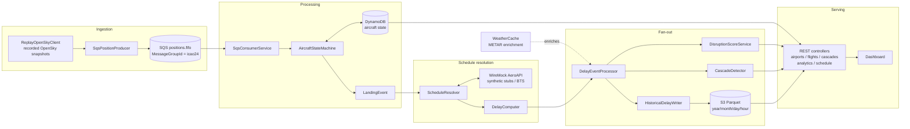

# SkyTrack Architecture

Real-time flight delay detection and airport-disruption scoring. Aircraft positions flow
through an SQS-decoupled pipeline into a per-aircraft state machine that detects landings,
resolves each landing against a flight schedule, computes the delay, and fans the resulting
`DelayEvent` out to disruption scoring, cascade prediction, and historical (S3 Parquet)
storage. Six REST endpoints serve the results; a dashboard consumes them.

The same Mermaid source below is embedded in the [README](../README.md) so it renders on
GitHub.

## Pipeline

## The five layers

1. **Ingestion** — `ReplayOpenSkyClient` replays recorded OpenSky ADS-B snapshots (or
   `LiveOpenSkyClient` polls the real API). `SqsPositionProducer` publishes one message per
   aircraft position to `skytrack-positions.fifo` with `MessageGroupId = icao24`, giving
   per-aircraft ordering. See [ADR 0001](adr/0001-sqs-fifo-over-kinesis.md).

2. **Processing** — `SqsConsumerService` drains the queue into `AircraftStateMachine`, which
   tracks each aircraft through flight phases
   (`UNKNOWN → EN_ROUTE → APPROACHING → ON_GROUND → DEPARTED`), persisting state to DynamoDB
   ([single-table design](adr/0002-single-table-dynamodb.md)) and emitting a `LandingEvent`
   on touchdown.

3. **Schedule resolution** — `ScheduleResolver` looks up each landing's scheduled arrival via
   `AeroApiClient` (pointed at WireMock-served synthetic stubs locally; a future BTS tier or
   the real AeroAPI in production). `DelayComputer` then computes
   `delay = actualArrival − scheduledArrival`. See
   [ADR 0003](adr/0003-synthetic-and-bts-over-paid-api.md).

4. **Processing fan-out** — `DelayEventProcessor` enriches each `DelayEvent` with weather
   (`WeatherCache`, METAR) and dispatches it to three independent consumers:
   `DisruptionScoreService` (in-memory sliding-window airport scores,
   [ADR 0004](adr/0004-in-memory-sliding-windows.md)), `CascadeDetector` (predicts downstream
   delay propagation), and `HistoricalDelayWriter` (buffers and flushes Parquet to S3,
   partitioned `year/month/day/hour`).

5. **Serving** — six Spring REST controllers expose the live and historical results, consumed
   by the dashboard.

## Local-first development

Every external dependency is swapped by Spring profile: LocalStack stands in for
SQS/DynamoDB/S3, WireMock for the schedule API, and recorded fixtures for OpenSky and weather.
Switching `local → prod` is a profile swap, not a code change. See
[ADR 0005](adr/0005-local-first-localstack-wiremock.md).
